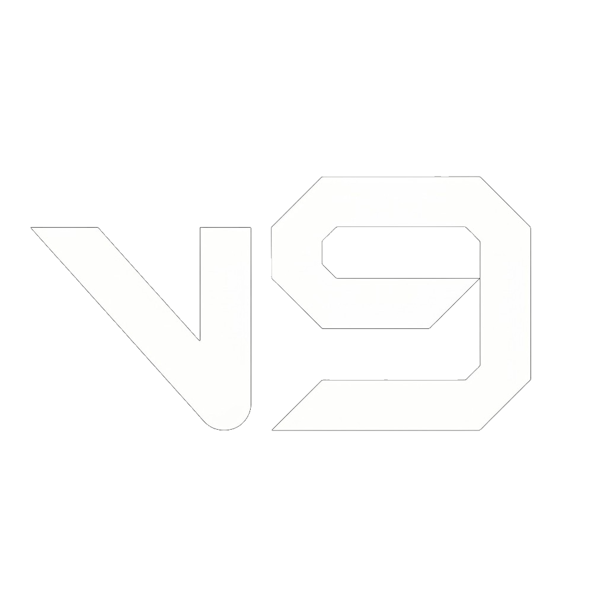

<p align="center">
  
</p>

<p align="center">
  <strong>ESP-оверлей для Penguin Hotel</strong> — минималистичный чёрно-оранжевый интерфейс, русская локализация, кастомный title bar с перетаскиванием.
</p>

<p align="center">
  <a href="https://github.com/voidmute/v9/releases"></a>
  <a href="LICENSE"></a>
  <a href="https://github.com/voidmute/v9"></a>
</p>

---

## Возможности

| Раздел | Описание |
|--------|----------|
| **Визуал** | Рамка, скелет, линии, имена, роли, дистанция, фильтр врагов |
| **Камера** | Кастомный FOV |
| **Игроки** | Список игроков и телепорт |
| **Цвета** | Палитра ESP + сохранение настроек |

- Острые углы, без прозрачности — чёткий UI поверх игры  
- Перетаскивание окна за title bar  
- Сворачивание / закрытие меню кнопками **−** и **×**  
- Плавная смена вкладок и индикатор активного раздела  

---

## Быстрый старт

### 1. Скачайте релиз

Перейдите в [Releases](https://github.com/voidmute/v9/releases) и скачайте **`v9-esp-win64.zip`**.

### 2. Распакуйте в одну папку

```
v9/
├── v9.dll
├── v9injector.exe
├── inject-v9-esp.bat
└── inject-v9-esp.ps1
```

### 3. Запустите игру

Процесс: **`PenguinHotel-Win64-Shipping.exe`**

### 4. Инжект

Дважды кликните **`inject-v9-esp.bat`** (при ошибке — от имени администратора).

Или в PowerShell:

```powershell
cd путь\к\папке
.\v9injector.exe PenguinHotel-Win64-Shipping.exe ".\v9.dll"
```

---

## Горячие клавиши

| Клавиша | Действие |
|---------|----------|
| **INSERT** | Открыть / закрыть меню |
| **END** | Выгрузить ESP из игры |

Настройки сохраняются в `C:\v9\settings.ini` (папка создаётся автоматически).

---

## Сборка из исходников

**Требования:** Windows 10/11 x64, Visual Studio 2022 Build Tools (MSVC v143), Windows SDK.

```powershell
cd v9
.\build.bat
```

Готовые файлы появятся в папке **`built/`**.

Полная сборка (ESP + инжектор + camouflage):

```powershell
powershell -ExecutionPolicy Bypass -File .\scripts\build_all.ps1
```

---

## Структура репозитория

```
v9/
├── assets/          # Логотип (logo-t.png)
├── v9/              # Исходники ESP (DLL)
├── runtime/         # Инжектор, bridge, camouflage
├── scripts/         # Скрипты сборки
├── built/           # Собранные бинарники (после build)
├── build.bat
└── README.md
```

---

## Важно

- Используйте **только на свой страх и риск**. Автор не несёт ответственности за баны или сбои.
- Не запускайте **ESP и camouflage одновременно** — возможен конфликт D3D12-хуков.
- Репозиторий предназначен для образовательных целей и личного использования.

---

## Лицензия

[MIT](LICENSE) © 2026 [voidmute](https://github.com/voidmute)
